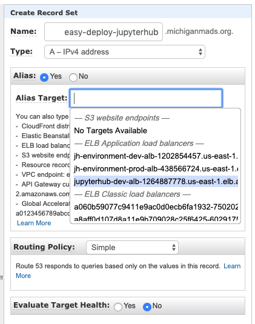
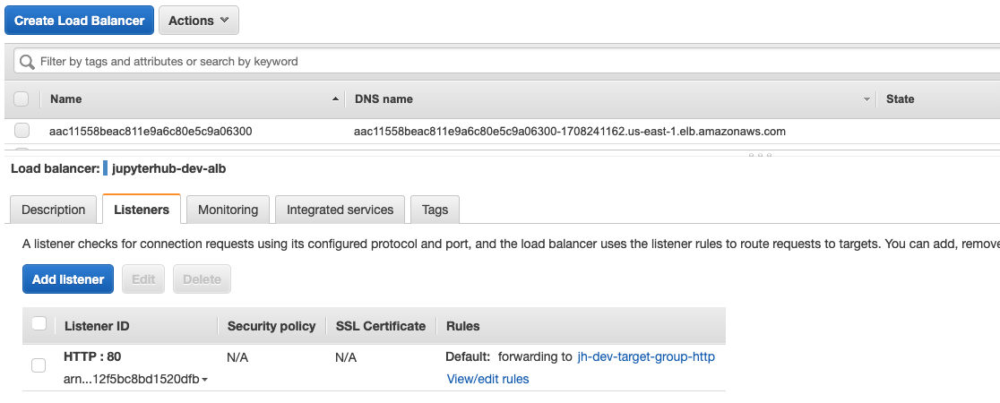
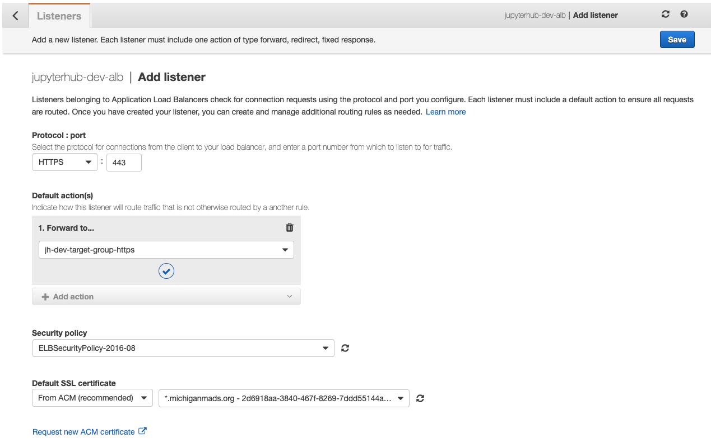
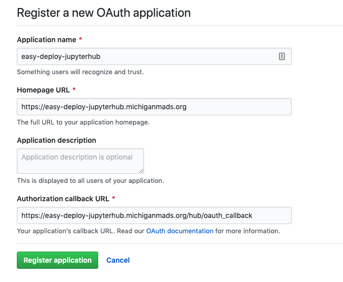
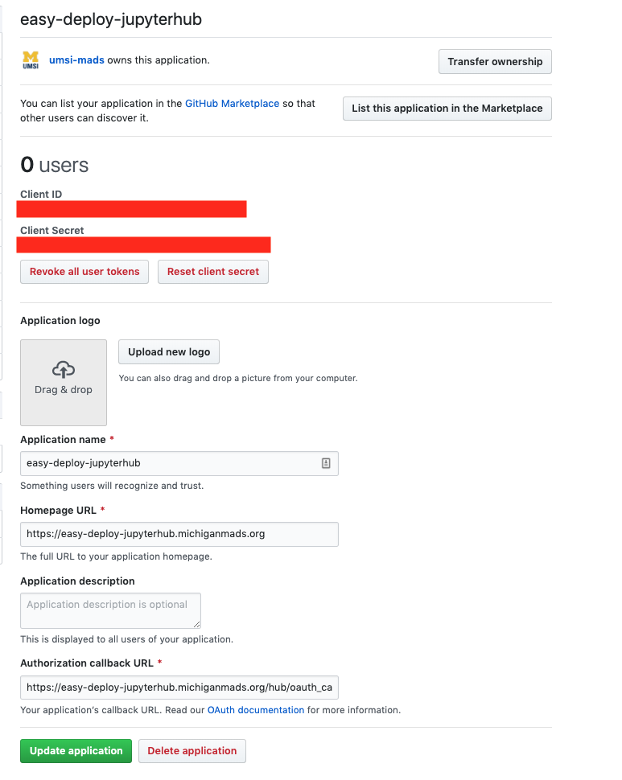
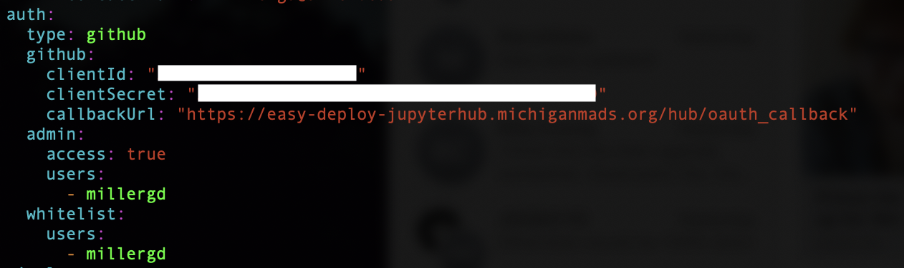
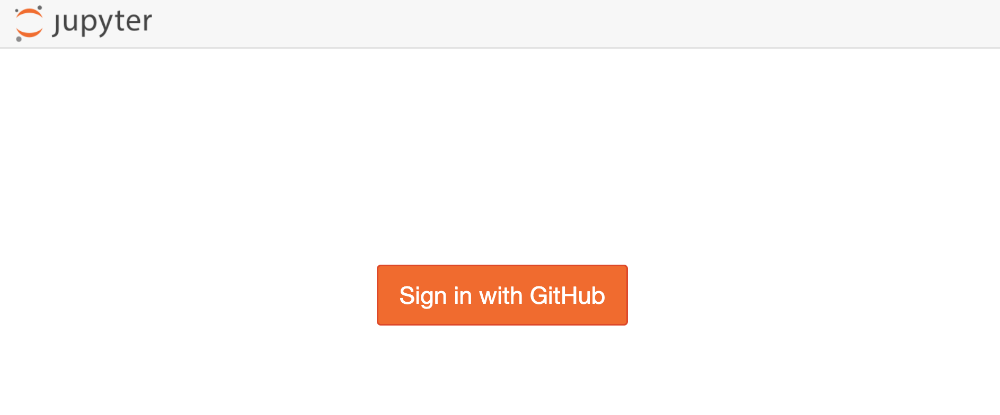
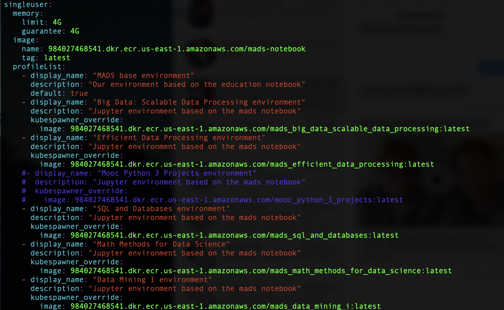
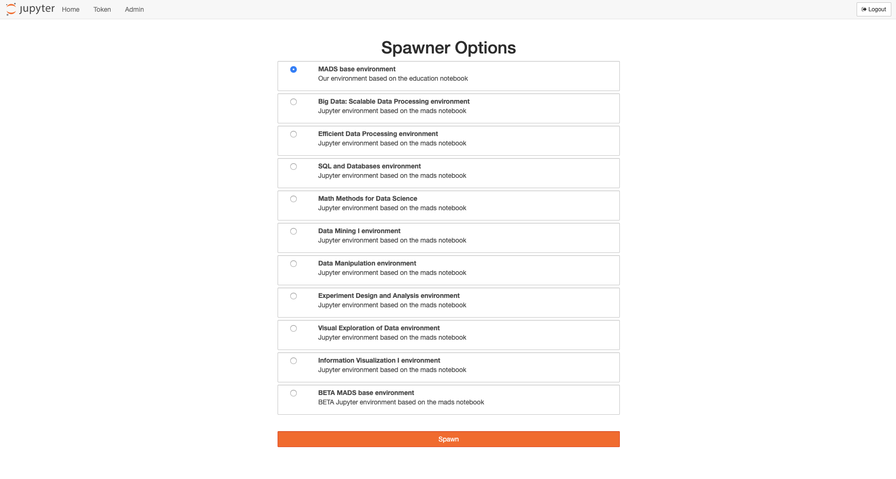

# Easy Deploy JupyterHub

The purpose of this project is to provide a one-click deployment of a JupyterHub server that is immediately ready for many people to use. The JupyterHub runs on a Kubernetes cluster in AWS. It persists user data on an NFS server in AWS, autoscales automatically, and can easily be configured further for your needs.

## Deployment

### Prerequisites

Install ruamel.yaml which is a Python package that can configure Cloudformation Yaml files:

`pip install ruamel.yaml`

You need to create an IAM role that will be used to create and control your cluster. Give this role admin access, and configure the AWS CLI to use this role.  Put the name of this role in `config.yaml`.

You need to create an SSH key from the AWS console. Download this key so you can use it later. Put the name of this key in `config.yaml`.

### Build package

`make build-dev` or `make build-prod`

### Deploy package

`make deploy`

### Test your JupyterHub

Deploying the package will kick off a Cloudformation build in AWS. You can check the status of this build by going to the Cloudformation service in the AWS console. It takes about 15 minutes for everything to build. Once it's finished building, go to the EC2 service and find the loadbalancer for your JupyterHub. Copy the domain of the loadbalancer in your browser and you should see a working JupyterHub!

### Configuring your cluster

Your JupyterHub cluster is managed by a control node. You can access this node with the SSH key you entered in the `config.yaml` file. You can find the ip address / domain of the control node in the EC2 service console and then ssh using the following command:

`ssh -i "ec2-key.pem" ec2-user@ec2-3-93-72-11.compute-1.amazonaws.com`

Below are a few commands you can run on your control node once you have opened up an ssh connection:

**TBD...**

## Extra Configuration

Below is a list of custom configurations you can add to your JupyterHub.

### Custom Domain

In AWS, it is very easy to create a custom domain and point it at your JupyterHub load balancer. Simply create a Route53 domain and point it at your load balancer as an "A" record set. 

### HTTPS

Once you have a custom domain pointing to your JupyterHub, you can implement secure access to your JupyterHub by adding a HTTPS listener on port 443 of the load balancer. When adding an HTTPS listener through the AWS console, you will be required to use an SSL certificate. If you don't have one already for your custom domain, you will need to generate one through Amazon's Certificate Manager (ACM). For the listener's default action, choose the https target group that was generated when you deployed your cluster.

The final step in enabling HTTPS requires you to ssh into the control node and change the helm chart configuration. Once you ssh into the control node:

`ssh -i "ec2-key.pem" ec2-user@ec2-3-93-72-11.compute-1.amazonaws.com`

There is a file called `config.yaml`. Uncomment the https section under the proxy settings. 

Then re-apply the configuration by running the following command:

`helm upgrade --install jhub jupyterhub/jupyterhub --namespace jhub --version 0.8.2 --values config.yaml`

You should now be able to access your cluster via https.

### GitHub Auth

The helm chart we're using is already set up to accept GitHub authentication, all you need to do is set up a GitHub app and configure some more details in the helm config. First let's set up the GitHub app.

Log into GitHub with your own GitHub account and create a new OAuth app under settings > OAuth Apps. Give it any name you want, enter your domain in the "Homepage URL" and then enter `https://<yourdomain>/hub/oauth_callback` into the Authorization callback URL (replace "yourdomain" with your actual domain). Once you create the app, save the app's client ID and Client Secret somewhere.

Once your GitHub app is set up, ssh into the control node and open up the `config.yaml` like you did in the above section. Uncomment the auth section, and change `clientId`, `clientSecret`, and `callbackUrl` to align with what's in your GitHub app. Add in any GitHub users under `admin` and `whitelist` that you want to use the JupyterHub. Re-apply the configuration to get the updates.

Next time you log into the hub, it should ask you to login with your GitHub credentials.

### Custom Notebook Images

To add in custom notebook profiles beyond the scipy notebook, you have to edit the helm config once again. In the `singleuser` section, see the profile list section  and notice an example custom profile. You can add as many of these as you'd like. Just make sure to re-apply the configuration to get the updates.

